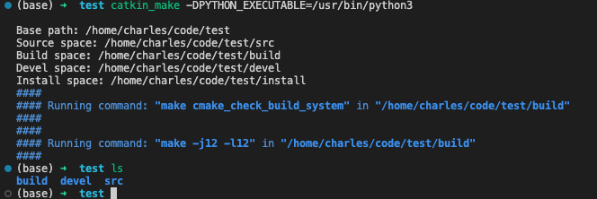

# ROS环境搭建

## ROS安装（ubuntu）

推荐使用鱼香ROS一键安装。 

[参考链接](https://blog.csdn.net/m0_74641031/article/details/132910858)


## 创建工作空间

创建test文件夹以及src子文件夹

```
mkdir -p  ./test/src
```

进入工作空间文件夹并编译
```
cd  ./test
catkin_make # or catkin_make -DPYTHON_EXECUTABLE=/usr/bin/python3
```

结果如下



会自动创建build以及devel文件夹，后续用户代码需存放在src文件夹内。

## 代码目录和编译

- [使用ros编译运行自己写的程序](https://blog.csdn.net/weixin_45617478/article/details/110205534)

- [在CMakeLists.txt中添加源文件的几种方法](https://zhuanlan.zhihu.com/p/631113006)


